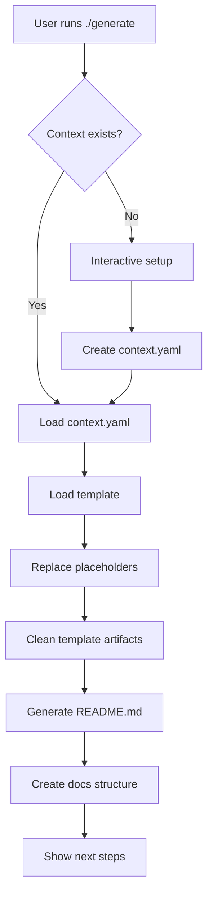

# Architecture

System design and technical architecture of the documentation framework.

## Overview

The documentation framework follows a simple, file-based architecture with no runtime dependencies. It generates static documentation from templates and metadata.

```
┌─────────────────┐    ┌──────────────────┐    ┌─────────────────┐
│   User Input    │───▶│   Generator      │───▶│  Documentation  │
│                 │    │                  │    │                 │
│ • Interactive   │    │ • Template       │    │ • README.md     │
│   prompts       │    │   processing     │    │ • docs/         │
│ • context.yaml  │    │ • Placeholder    │    │ • Clean output  │
│ • CLI options   │    │   replacement    │    │                 │
└─────────────────┘    └──────────────────┘    └─────────────────┘
```

## Components

### 1. Generator script (`generate`)

**Purpose:** Core CLI tool that orchestrates documentation generation

**Key functions:**
- Interactive project setup
- Template downloading and processing
- Placeholder replacement
- Content cleaning and validation

**Architecture:**
```bash
generate
├── CLI argument parsing
├── Context file management
├── Template processing
├── Content generation
└── Cleanup and validation
```

### 2. Template system

**Purpose:** Standardised documentation structure with placeholders

**Components:**
- `README-TEMPLATE.md` - Main documentation template
- Placeholder system (`{{VARIABLE}}` and `[instructions]`)
- Section structure following Diátaxis principles

**Template architecture:**
```
README-TEMPLATE.md
├── Header (title, tagline)
├── Demo section
├── TL;DR summary
├── Contents (navigation)
├── Context metadata
├── Core sections
│   ├── Quickstart
│   ├── Usage  
│   ├── Features
│   ├── Requirements
│   └── Configuration
├── Advanced sections
│   ├── Differentiation
│   ├── Architecture
│   └── Roadmap
└── Community sections
    ├── Support
    ├── Contributing
    ├── Security
    └── Licence
```

### 3. Metadata system

**Purpose:** Machine-readable project information

**Structure:**
```yaml
# docs/context.yaml
project: string        # Human-readable name
domain: string         # Project category
audience: string       # Primary users
interfaces: string     # User interaction methods
runtime: string        # Technical requirements
storage: string        # Data persistence
deployment: string     # Deployment targets
status: enum           # Development stage
license: string        # Legal terms
support: string        # Help channel
```

### 4. Quality tools integration

**Purpose:** Automated documentation quality assurance

**Tools:**
- **Prettier** - Markdown formatting
- **markdownlint** - Style consistency
- **cspell** - Spell checking (en-GB)
- **Vale** - Prose linting
- **markdown-link-check** - Link validation

**Integration points:**
```
Quality Pipeline
├── Format check (Prettier)
├── Lint check (markdownlint)
├── Spell check (cspell)
├── Prose check (Vale)
└── Link check (markdown-link-check)
```

## Design principles

### 1. Simplicity first

- **No runtime dependencies** - Pure bash script with standard tools
- **File-based** - No databases or complex state management
- **Portable** - Works on any Unix-like system

### 2. Convention over configuration

- **Standard structure** - Predictable file locations
- **Sensible defaults** - Minimal configuration required
- **Template-driven** - Consistent output format

### 3. Progressive enhancement

- **Basic usage** - One-line installation and setup
- **Advanced features** - Quality tools and customisation
- **Integration ready** - CI/CD and automation support

### 4. AI-friendly design

- **Structured metadata** - Machine-readable context
- **Stable anchors** - Predictable section organisation
- **Clear instructions** - Explicit placeholder format

## Data flow

### Generation process



### Template processing

```mermaid
graph TD
    A[README-TEMPLATE.md] --> B[Copy to README.md]
    B --> C[Replace {{VARIABLES}}]
    C --> D[Replace [instructions]]
    D --> E[Remove HTML comments]
    E --> F[Remove template guidance]
    F --> G[Fix section structure]
    G --> H[Clean empty sections]
    H --> I[Final README.md]
```

## Scalability considerations

### File size limits

- **Templates** - Keep under 500 lines for maintainability
- **Generated docs** - Aim for 200-400 lines in README
- **Context files** - Limit to essential metadata

### Performance characteristics

- **Generation time** - Sub-second for typical projects
- **Memory usage** - Minimal (bash + sed operations)
- **Network dependency** - Only for remote template download

### Extensibility points

1. **Custom placeholders** - Add project-specific variables
2. **Template variants** - Different templates for different domains
3. **Post-processing** - Additional cleanup or enhancement steps
4. **Integration hooks** - CI/CD and automation integration

## Security model

### Threat model

**Risks:**
- Remote code execution via template injection
- Information disclosure through generated docs
- Supply chain attacks via template source

**Mitigations:**
- Template sanitisation and validation
- No dynamic code execution in templates
- HTTPS-only template downloads
- Content review for sensitive information

### Security boundaries

```
Trust Boundaries
├── User input (untrusted)
│   ├── CLI arguments
│   ├── Interactive responses
│   └── Context file content
├── Template source (semi-trusted)
│   ├── GitHub repository
│   └── Remote downloads
└── Generated output (trusted)
    ├── README.md
    └── docs/ structure
```

### Best practices

1. **Input validation** - Sanitise user-provided content
2. **Template review** - Audit templates before use
3. **Output scanning** - Check generated docs for sensitive data
4. **Access control** - Limit who can modify templates

## Monitoring and observability

### Metrics to track

- **Generation success rate** - Percentage of successful runs
- **Template download latency** - Network performance
- **User completion rate** - Interactive setup completion
- **Error frequency** - Common failure modes

### Logging strategy

```bash
# Debug mode logging
DOCS_GENERATOR_DEBUG=1 ./generate

# Log levels
ERROR   - Fatal errors that prevent generation
WARN    - Non-fatal issues or missing optional components  
INFO    - Progress updates and major steps
DEBUG   - Detailed operation logging
```

### Health checks

```bash
# Validate generator integrity
./generate --version

# Test template accessibility  
curl -I https://raw.githubusercontent.com/mitchellfyi/documentation/main/README-TEMPLATE.md

# Verify quality tools
npx prettier --version
npx markdownlint-cli2 --version
```

## Future architecture considerations

### Planned enhancements

1. **Multi-template support** - Different templates for different project types
2. **Plugin system** - Custom processing steps
3. **Web interface** - Browser-based generation
4. **API mode** - Programmatic access

### Migration strategy

- **Backwards compatibility** - Maintain existing CLI interface
- **Gradual rollout** - Feature flags for new capabilities
- **Documentation** - Clear upgrade paths and breaking changes

### Technology decisions

**Why bash?**
- Universal availability on Unix systems
- No additional runtime dependencies
- Simple text processing with sed/awk
- Easy to audit and modify

**Why file-based?**
- Simple to understand and debug
- Version control friendly
- No infrastructure requirements
- Portable across environments

**Why template-driven?**
- Consistent output structure
- Easy to maintain and update
- Supports customisation
- Scales to multiple project types
